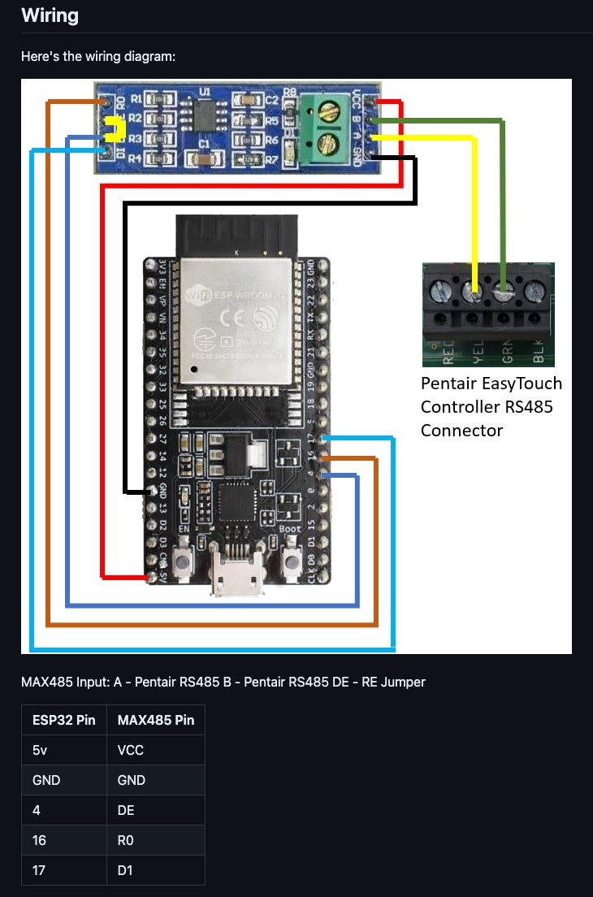

# home-automation

## Home Assistant

## Shelly

### Offline Firmware Update

1. Download the firmware you need from the [Shelly Forum Firmware Topic](https://www.shelly-support.eu/index.php?shelly-firmware-archive/).
2. Add it to repository [npawelek/firmware](https://github.com/npawelek/firmware).
3. The network/nginx deployment will automatically sync the firmware repository every `60s`.
4. Use the Shelly OTA URL which points to the locally served file.
    ```
    # Set some variables to make this easier (USER and PASS are only required if authentication is enabled)
    ADDR=192.168.10.
      USER=
      PASS=

    # Shelly Flood (SHWT-1) Example
    http --auth $USER:$PASS http://$ADDR/ota?url=http://int.${SECRET_DOMAIN}/shelly/SHWT-1/v1.11.8.zip

    # Shelly Motion (SHMOS-01) Example
    http --auth $USER:$PASS http://$ADDR/ota?url=http://int.${SECRET_DOMAIN}/shelly/SHMOS-01/v2.0.5.zip

    # Shelly Door/Window 2 (SHDW-2) Example
    http --auth $USER:$PASS http://$ADDR/ota?url=http://int.${SECRET_DOMAIN}/shelly/SHDW-2/v1.11.8.zip
    ```

## Valetudo

### Valetudo Firmware Update

Valetudo instructions can be found [here](https://valetudo.cloud/pages/general/upgrading.html).

```
ssh root@192.168.10.146
killall valetudo
wget http://int.${SECRET_DOMAIN}/valetudo/2026.02.0/valetudo-aarch64 -O /data/valetudo

reboot
```

### Maploader binary

```
ssh root@192.168.10.146
wget http://int.${SECRET_DOMAIN}/maploader/v1.8.1/maploader-arm64 -O /data/maploader-binary
chmod +x /data/maploader-binary

# Verify it is loaded at boot (second line in the if block)
vi /data/_root_postboot.sh
if [[ -f /data/valetudo ]]; then
        VALETUDO_CONFIG_PATH=/data/valetudo_config.json /data/valetudo > /dev/null 2>&1 &
        VALETUDO_CONFIG_PATH=/data/valetudo_config.json /data/maploader-binary > /dev/null 2>&1 &
fi

reboot
```

## Pentair RPI4 Controller

###

Steps to utilize an RPI4 and MAX485 to interface with the existing COM port on the EasyTouch controller. Here are the steps used to build it.

### Install Steps

Install and configure nodejs-poolController and nodejs-poolController-dashPanel.


